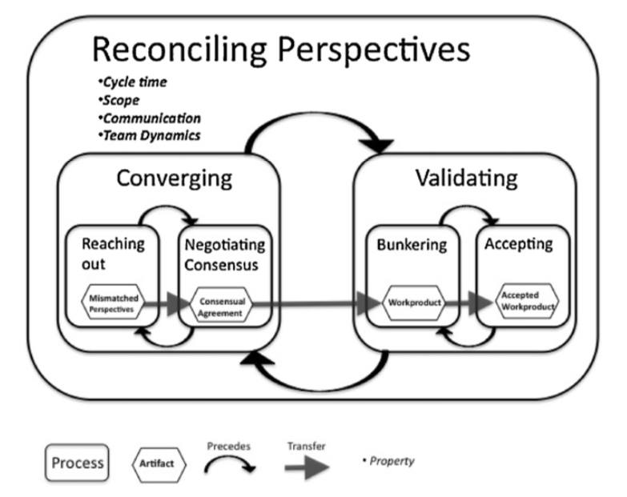

On the evening of May 21st I went along to the eXtreme Tuesday Club (XTC), where my colleague, Andy Parker, [ran a session](https://www.meetup.com/eXtreme-Tuesday-Club-XTC/events/ncwwmqyzhbcc/) on a model of software engineering called ["Reconciling Perspectives"](http://www.sxf.uevora.pt/wp-content/uploads/2013/03/Adolph_20121.pdf). I work remotely from Bristol, but I regularly visit my companies London offices to catch up with colleagues in person and it's also nice to take the opportunity to go to interesting London based techie meetups, like this one, in the evening.

The model, as I understood it, describes the essential social dynamics and communications that happen between the participants in a successful software development project. So rather than being prescriptive, a process that could be followed to build better software, it was descriptive, identifying the core activities that occur in such successful projects.

The model says software development is about "getting a job done", which necessitates "reconciling perspectives" through "converging" on what to build, and "validating" that what has been built is acceptable. This process is further broken down to:

  * "Reaching out" - A mismatch in perspectives is noticed by someone who then attempts to start a conversation to resolve this. (features, quality, schedule, priorities)
  * "Negotiating consensus" - The people with the mismatched perspective try to resolve it
  * "Bunkering" - Work is done to build what was agreed (write code etc.)
  * "Accepting" - The completed work is reviewed to see if its what was expected.

The [paper describing the model](http://www.sxf.uevora.pt/wp-content/uploads/2013/03/Adolph_20121.pdf), which was published in 2012, also explains how it was established through the "grounded theory" qualitative research method. I’m guessing that Andy’s interest in this paper was partly triggered by its use of grounded theory, as it’s something he’s talked about at work a number of times. Grounded theory is a research method that seeks to establish explanations by collecting data that is "..useful for explaining behavioral patterns that shape social processes as people interact in groups". Andy runs a different meetup, called "Researching Software Engineering", which discusses published academic papers where they also [discussed this paper](https://www.meetup.com/Researching-Software-Engineering/events/259704281/) and I believe he ran a [similar session](https://twitter.com/Jtf/status/1129679775281418240) to the one at XTC at the recent [CITCON open conference](http://www.citconf.com/ghent2019/) in Ghent.

However Andy didn’t ask us to discuss the flaws or otherwise of the method used to construct the model at this meetup, but to reflect on it as software development practitioners.

After a short summary of the model from the Andy, he invited the group to start discussing what they thought of it. However, it initially seemed that people had misunderstood Andy’s request and started espousing what they thought were the essential activities of a successful software project. Fortunately a delivery of pizza intervened which, after consumption, allowed Andy to "restart" the conversation by asking people what, in their experience, they saw as obstacles to achieving the essential activities as described in the model. This led to a much more fruitful exchange of experience.

I didn’t write any notes in the meetup but here are a few of the things I recall being suggested:

  * Reaching out
    * You’re less likely to reach out in an environment where you are fearful of being criticised
  * Negotiating consensus
    * A boss may expect her opinion to always prevail because of her status
  * Bunkering
    * Could be impeded by a distracting environment, such as frequent interruptions from Slack.
  * Accepting
    * Larger pieces of work are harder to check

I found the discussion and proposed model sufficiently interesting that I subsequently read the paper, which goes into further detail breaking the behaviours and communications down into more concepts. The theory seems a reasonable description of the dynamics I’ve experienced on a software development project, and if nothing else provided an interesting lens through which to discuss the difficulties we encounter, and to prompt possible remedies. The paper itself concludes with three recommendations on the basis of its theory:

  1. A necessary condition for the success of a software project is that there is at least one individual who is sufficiently engaged that they can detect Perspective Mismatches, and who has the personal strength to reach out and initiate the Reconciling Perspectives process.
  1. The health of a software project, and its probability of success, can be measured by the number of conversations where people are Reaching Out and Negotiating Consensus.
  1. Team training and development of principled negotiation skills for software developers has good potential for improving team performance.

Andy has written up reviews of some of the papers on [his blog](https://softwarelifecycle.wordpress.com/) that his researching software engineering meetup has covered, so hopefully [he’ll also eventually post his thoughts](https://twitter.com/aparker42/status/1124599182231261184) online about this paper.
